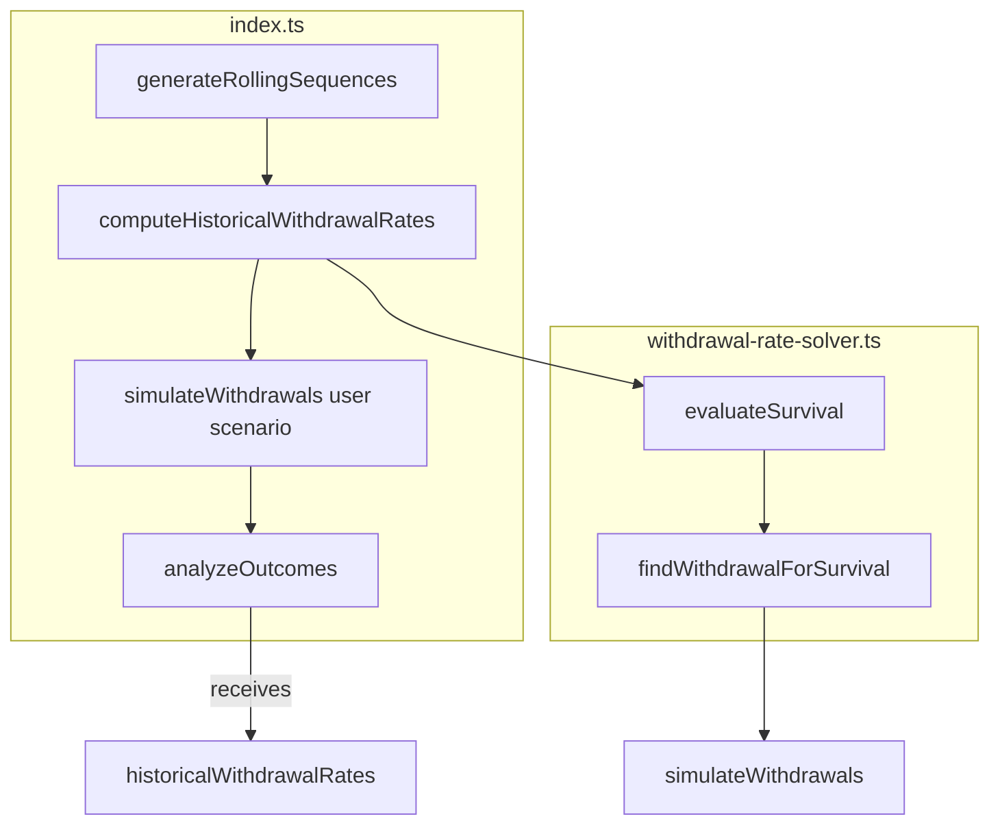

# Historical Withdrawal Rate Solver (Revised)

## Architecture

The solver lives **outside** `analyzeOutcomes`. Pipeline order:




**Data flow:**

```
generateRollingSequences
      ↓
computeHistoricalWithdrawalRates(sequences, portfolioMapping, totalValue)
      ↓
simulateWithdrawals (user scenario)
      ↓
analyzeOutcomes(outcomes, sequences, totalSequences, historicalWithdrawalRates)
```

`analyzeOutcomes` **consumes** `historicalWithdrawalRates`; it does **not** compute them.

---

## 1. Create `withdrawal-rate-solver.ts`

New file: [src/retirement-analytics/engine/withdrawal-rate-solver.ts](src/retirement-analytics/engine/withdrawal-rate-solver.ts)

### Type

```ts
export type WithdrawalDistribution = {
  p10: number;
  p25: number;
  p50: number;
  p75: number;
  p90: number;
};
```

Use this type across the solver and `analyzeOutcomes`.

### Constants

```ts
const MIN_WITHDRAWAL = 0.02;   // 2% - historical rates typically 2–7%
const MAX_WITHDRAWAL = 0.08;   // 8%
const TOLERANCE = 0.0001;
const MAX_ITERATIONS = 15;
const TARGET_SURVIVAL = { p10: 0.10, p25: 0.25, p50: 0.50, p75: 0.75, p90: 0.90 };
```

Narrow search bounds (2–8%) improve convergence and avoid unnecessary extreme-rate simulations.

### Shared survival cache

Use `Map<number, number>` keyed by rate. **Standardized cache key:**

```ts
const key = Math.round(rate * 100000);
```

Avoids string allocations and keeps lookups fast. Pass the cache into `evaluateSurvival` and `findWithdrawalForSurvival` so all percentile searches share it.

### `evaluateSurvival(rate, sequences, portfolioMapping, totalValue, cache?)`

- Check cache: `cache.get(Math.round(rate * 100000))`
- For each sequence: `simulateWithdrawals(portfolioMapping, totalValue, sequence, rate * totalValue)`
- Return `survivors / sequences.length`
- Store result in cache on miss

### `findWithdrawalForSurvival(targetSurvival, sequences, portfolioMapping, totalValue, cache)`

**Pre-check for unreachable targets:**

```ts
const minSurvival = evaluateSurvival(MAX_WITHDRAWAL, ...);
const maxSurvival = evaluateSurvival(MIN_WITHDRAWAL, ...);
if (targetSurvival > maxSurvival) return MIN_WITHDRAWAL;
if (targetSurvival < minSurvival) return MAX_WITHDRAWAL;
```

Binary search in [2%, 8%]:

- Midpoint: `rate = (low + high) / 2`
- `survivalFraction = evaluateSurvival(rate, ...)`
- If `survivalFraction >= targetSurvival` → `low = rate`, else `high = rate`
- **Convergence guard**: `if (Math.abs(high - low) < TOLERANCE) break`
- Also stop when `MAX_ITERATIONS` reached
- Return `low`

### `computeHistoricalWithdrawalRates(sequences, portfolioMapping, totalValue): WithdrawalDistribution`

**Always use `totalValue`** for `initialPortfolioValue` in simulations.

**Percentile order:**

1. Solve **p50** first
2. Solve **p25** and **p75** (can run in parallel)
3. Solve **p10** and **p90** (can run in parallel)

**Monotonicity enforcement** after solving:

```ts
results.p25 = Math.max(results.p25, results.p10);
results.p50 = Math.max(results.p50, results.p25);
results.p75 = Math.max(results.p75, results.p50);
results.p90 = Math.max(results.p90, results.p75);
```

Enforce `p10 ≤ p25 ≤ p50 ≤ p75 ≤ p90` to avoid floating-point inversions.

Return `WithdrawalDistribution`.

---

## 2. Retirement horizon

Sequences are already horizon-specific: `generateRollingSequences(withdrawalYears, ...)` produces sequences of length `withdrawalYears * 12` months. The solver uses these same sequences; no extra horizon parameter needed.

---

## 3. Update `index.ts`

Insert `computeHistoricalWithdrawalRates` **after** sequences and **before** user-scenario simulations:

```ts
// Phase 3: Generate rolling sequences
const { sequences, missingData: stressTestMissingData } = await generateRollingSequences(...);

// Phase 3b: Compute historical withdrawal rate distribution (before user scenario)
const historicalWithdrawalRates = computeHistoricalWithdrawalRates(
  sequences,
  portfolioMapping,
  totalValue
);

// Phase 4: Simulate withdrawals for user scenario
const outcomes = sequences.map(sequence => ...);

// Phase 5: Analyze outcomes and assess characteristics
const stressTestResults = analyzeOutcomes(outcomes, sequences, sequences.length, historicalWithdrawalRates);
```

---

## 4. Update `analyzeOutcomes`

File: [src/retirement-analytics/engine/outcome-analyzer.ts](src/retirement-analytics/engine/outcome-analyzer.ts)

- Add parameter: `historicalWithdrawalRates: WithdrawalDistribution`
- **Remove** the heuristic block (lines 55–70)
- **Remove** any computation of `historicalWithdrawalRates`; use the passed-in value
- For empty outcomes, return `historicalWithdrawalRates: { p10: 0, p25: 0, p50: 0, p75: 0, p90: 0 }` (or pass-through if caller provides)

---

## 5. Export `WithdrawalDistribution`

Export from [src/retirement-analytics/types.ts](src/retirement-analytics/types.ts) or from the solver module. Use consistently in `StressTestResult`, `analyzeOutcomes`, and solver.

---

## 6. Optional future optimization (no implementation now)

The solver currently calls `simulateWithdrawals`, which may perform more work than needed. If performance becomes an issue later, consider adding a lighter simulation function (e.g., `simulateSequenceWithdrawal`) that bypasses portfolio mapping. Keep in mind for future optimization.

---

## 7. Files changed


| File                                                        | Action                                                                          |
| ----------------------------------------------------------- | ------------------------------------------------------------------------------- |
| `src/retirement-analytics/engine/withdrawal-rate-solver.ts` | Create                                                                          |
| `src/retirement-analytics/index.ts`                         | Modify (add solver call, pass `historicalWithdrawalRates` to `analyzeOutcomes`) |
| `src/retirement-analytics/engine/outcome-analyzer.ts`       | Modify (add param, remove heuristic)                                            |
| `src/retirement-analytics/types.ts`                         | Optional: add/export `WithdrawalDistribution` if centralizing types             |


---

## 8. Testing

- Unit tests for `evaluateSurvival`, `findWithdrawalForSurvival` with mock sequences
- Verify unreachable-target guard returns clamped values
- Verify `computeHistoricalWithdrawalRates` returns monotonic p10 ≤ p25 ≤ p50 ≤ p75 ≤ p90
- Run [test-analysis.ts](src/retirement-analytics/__tests__/test-analysis.ts) end-to-end

