# Semantic context planning

Ask Linc selects optional analysis data with a two-pass `contextPlanner` subsystem. No production data-pack decision depends on a list of words, phrases, or regular expressions.

The name has two related meanings:

- **Context-planning subsystem** — the preflight planner plus the primary model's constrained data-pack tool.
- **`contextPlanner` model slot** — only the OpenAI preflight model. The second pass uses the configured **Primary analysis** Claude model so the model that will write the answer can inspect and widen its own inputs.

## Request flow

```mermaid
flowchart LR
    A["Active decision transcript"] --> B["Preflight contextPlanner"]
    B --> C["Validate packs, dependencies, and public search queries"]
    C --> D["Load canonical snapshot projection; defer web search"]
    D --> E["Primary model: request_data_packs tool"]
    E -->|"packs or queries refined"| F["Load final projection and web evidence"]
    E -->|"existing plan accepted"| F
    F --> S
    S --> G["Write answer"]
    G --> H["Deterministic grounding"]
    H -->|"unsupported value"| I["Load every remaining pack and regenerate"]
    H -->|"grounded"| J["Deliver"]
    I --> J
```

1. The preflight planner reads the current message and both sides of the active decision's earlier turns. Assistant answers provide conversational references, not trusted financial facts.
2. It returns strict JSON: a boolean for every allowlisted pack, whether independent reasoning review is useful, a short explanation, retirement inputs explicitly stated by the user, a `scenarios` object keyed by registered calculator ID, and zero to three standalone public search queries. Search queries include a purpose and an optional Brave freshness window.
3. Application code rejects unknown IDs and adds transitive pack dependencies. Models do not grant access, fetch records, or calculate financial values.
4. The application loads the selected projection from the canonical snapshot, but deliberately defers Brave retrieval. Aggregate net worth, cash, debt, investments, allocation, category totals, and average cash flow are always available. For retirement requests, the persisted retirement calculation likewise waits until the primary audit completes.
5. Before answering, the configured primary analysis model must call `request_data_packs`. It sees the transcript, selected pack IDs, available canonical fact labels, the preflight search plan, and the keyed preflight scenario plans. It may accept the plans, request additional allowlisted packs, refine ambiguous search queries using the full conversation, or add a supported scenario the preflight missed; it cannot remove packs or calculate outcomes.
6. Requested additions are committed only after the wider data read succeeds. The application sends only validated standalone queries—not the raw user prompt—to Brave, merges and URL-deduplicates their results, and caches each full query/freshness combination independently for 30 minutes. Registry manifests supply combined scenario dependencies and deterministic executors. Retirement-specific baseline isolation remains application-owned; when packs do not widen, its deferred baseline is completed from the first snapshot instead of repeating the full context gather. Each calculator supplies validated scenario facts, compact evidence, and disclosure.
7. The same primary model then writes the answer from the final fact pack. Deterministic grounding remains the last safety boundary. If an answer still reaches for evidence it did not receive, recovery is exhaustive: load all remaining allowlisted packs and re-check or regenerate. This recovery does not infer a pack from the shape of a number or from language rules.

If the preflight call fails, the fallback is recall-safe and language-neutral: include every pack. Search still remains fail-closed because no raw prompt is substituted for a missing model-generated query. If the primary tool audit fails, a valid preflight search plan remains usable and the failure is recorded in the evidence manifest.

## Public search contract

`search_context` is a semantic decision, not a synonym list. Selecting it requires one to three queries that:

- make sense without the conversation transcript;
- contain no obvious email, Social Security, account, or card identifier;
- stay below the application limits of 240 characters and 32 words;
- classify their purpose as rate, rule, price, news, or other;
- use `pd`, `pw`, `pm`, `py`, or no freshness filter.

The provider receives the final query verbatim with Brave's `search_lang`, `ui_lang`, and `freshness` parameters. Provider failures are recorded as unavailable evidence rather than being represented as a successful search with zero results. Successful evidence records the final queries, result count, cache hits, provider calls, and retrieval time in the answer manifest.

## Data-pack contract

Pack definitions live in `src/openai/context-packs.ts`. Their IDs, descriptions, costs, and dependencies are application contracts and are intentionally code-reviewed. This hard-coded allowlist is a security and data-access boundary; it does not encode assumptions about how a user asks a question.

The optional packs are accounts, transactions, investments, monthly cash flow, profile, home value, deterministic retirement analysis, market context, and live rates/rules lookup.

## Admin and measurement

The `/admin` AI Settings tab contains:

- **Models in use** — configures the `contextPlanner` preflight slot and the Primary analysis slot used for both the tool audit and final answer.
- **Context planner** — runs the production preflight planner against a full Q&A transcript and explains direct versus dependency-added packs, planned public queries, purposes, and freshness windows.
- **Calculator registry** — shows each registered calculator's version, required packs, supported overrides, defaults, and outputs.

The Production tab's **Answer quality** report deliberately has no synthetic score. It separately reports:

- clean, corrected, and failed delivery outcomes;
- deterministic evidence verification;
- semantic planner acceptance, primary-tool expansions and failures, late all-pack recoveries, and planner fallback usage;
- user ratings;
- initial, tool-added, and final usage for every pack;
- requested, completed, unavailable, and unexpectedly unrun scenarios, plus calculator latency.
- requested and completed public-search retrievals, planned-query volume, Brave provider calls, cache reuse, results, and unavailable evidence.

The old editable routing vocabulary and browser-side keyword question categories were retired because neither represents the production decision path.

Every new evidence manifest stores the initial semantic plan, final packs, initial and final search queries, primary-tool outcome, search execution metadata, registry-keyed scenario executions, planner/tool/calculator latency, and any late recovery. Older singular retirement manifests remain readable as legacy observations.

## Scheduled market-news refresh

Scheduled market news is a separate proactive feed, not the per-question `search_context` path. Every four-hour run collects one external evidence batch—including six Brave topic searches—then synthesizes Starter, Standard, and Premium contexts from that same batch. A database-backed lease prevents another application instance or a near-simultaneous cron run from repeating the refresh. This replaces the former tier loop that collected the same six Brave searches three times (up to 18 calls per scheduled run).

See [Deterministic scenario modeling](SCENARIO_MODELING.md) for the boundary between semantic intent planning, deterministic calculation, and conditional scenario evidence.
