# Semantic context planning

Ask Linc selects optional analysis data with a two-pass `contextPlanner` subsystem. No production data-pack decision depends on a list of words, phrases, or regular expressions.

The name has two related meanings:

- **Context-planning subsystem** — the preflight planner plus the primary model's constrained data-pack tool.
- **`contextPlanner` model slot** — only the OpenAI preflight model. The second pass uses the configured **Primary analysis** Claude model so the model that will write the answer can inspect and widen its own inputs.

## Request flow

```mermaid
flowchart LR
    A["Active decision transcript"] --> B["Preflight contextPlanner"]
    B --> C["Validate pack IDs and add dependencies"]
    C --> D["Load canonical snapshot projection"]
    D --> E["Primary model: request_data_packs tool"]
    E -->|"additions requested"| F["Load wider projection"]
    E -->|"existing plan accepted"| S["Run requested deterministic scenario"]
    F --> S
    S --> G["Write answer"]
    G --> H["Deterministic grounding"]
    H -->|"unsupported value"| I["Load every remaining pack and regenerate"]
    H -->|"grounded"| J["Deliver"]
    I --> J
```

1. The preflight planner reads the current message and both sides of the active decision's earlier turns. Assistant answers provide conversational references, not trusted financial facts.
2. It returns strict JSON: a boolean for every allowlisted pack, whether independent reasoning review is useful, a short explanation, retirement inputs explicitly stated by the user, and any registered scenario overrides the user wants calculated.
3. Application code rejects unknown IDs and adds transitive pack dependencies. Models do not grant access, fetch records, or calculate financial values.
4. The application loads the selected projection from the canonical snapshot. Aggregate net worth, cash, debt, investments, allocation, category totals, and average cash flow are always available.
5. Before answering, the configured primary analysis model must call `request_data_packs`. It sees the transcript, selected pack IDs, available canonical fact labels, and the preflight scenario plan. It may accept the plan, request additional allowlisted packs, or add a supported scenario the preflight missed; it cannot remove packs or calculate outcomes.
6. Requested additions are committed only after the wider data read succeeds. If a scenario was requested, application code reads the calculator's required packs and supported overrides from the registry, runs its deterministic executor, and adds validated inputs plus results as scenario-scoped canonical facts.
7. The same primary model then writes the answer from the final fact pack. Deterministic grounding remains the last safety boundary. If an answer still reaches for evidence it did not receive, recovery is exhaustive: load all remaining allowlisted packs and re-check or regenerate. This recovery does not infer a pack from the shape of a number or from language rules.

If the preflight call fails, the fallback is recall-safe and language-neutral: include every pack. If the primary tool audit fails, the preflight plan remains usable and the failure is recorded in the evidence manifest.

## Data-pack contract

Pack definitions live in `src/openai/context-packs.ts`. Their IDs, descriptions, costs, and dependencies are application contracts and are intentionally code-reviewed. This hard-coded allowlist is a security and data-access boundary; it does not encode assumptions about how a user asks a question.

The optional packs are accounts, transactions, investments, monthly cash flow, profile, home value, deterministic retirement analysis, market context, and live rates/rules lookup.

## Admin and measurement

The `/admin` AI Settings tab contains:

- **Models in use** — configures the `contextPlanner` preflight slot and the Primary analysis slot used for both the tool audit and final answer.
- **Context planner** — runs the production preflight planner against a full Q&A transcript and explains direct versus dependency-added packs.
- **Calculator registry** — shows each registered calculator's version, required packs, supported overrides, defaults, and outputs.

The Production tab's **Answer quality** report deliberately has no synthetic score. It separately reports:

- clean, corrected, and failed delivery outcomes;
- deterministic evidence verification;
- semantic planner acceptance, primary-tool expansions and failures, late all-pack recoveries, and planner fallback usage;
- user ratings;
- initial, tool-added, and final usage for every pack;
- requested, completed, unavailable, and unexpectedly unrun scenarios, plus calculator latency.

The old editable routing vocabulary and browser-side keyword question categories were retired because neither represents the production decision path.

Every new evidence manifest stores the initial semantic plan, final packs, primary-tool outcome, scenario execution, planner/tool/calculator latency, and any late recovery. Older manifests remain readable as legacy observations.

See [Deterministic scenario modeling](SCENARIO_MODELING.md) for the boundary between semantic intent planning, deterministic calculation, and conditional scenario evidence.
