# Deterministic scenario modeling

Ask Linc can answer a supported what-if question with newly calculated, conditional results. A scenario result is not an observed financial fact and is not a forecast or guarantee. It is a deterministic model output produced from the user's canonical data plus a disclosed assumption ledger.

The first supported calculator compares retirement withdrawal-growth policies. The scenario boundary lives under `src/scenarios/` so additional domains can add their own validated plans, calculators, facts, and disclosures without moving arithmetic into an LLM.

## Request flow

```mermaid
flowchart LR
    A["Active decision transcript"] --> B["Semantic context plan"]
    B --> C["Primary-model tool audit"]
    C --> D["Canonical retirement baseline"]
    D --> E["Deterministic scenario runner"]
    E --> F["Scenario-scoped canonical facts"]
    F --> G["Answer generation"]
    G --> H["Deterministic grounding"]
    H --> I["Answer plus assumption disclosure"]
```

1. The OpenAI preflight planner identifies a requested scenario and returns a strict, typed policy plan. It does not calculate results.
2. The configured primary Claude model audits the plan while making its required `request_data_packs` call. It can supply a scenario plan when the preflight omitted one, but it does not receive data access or arithmetic authority.
3. Application code ensures the `retirement_analysis` pack and its dependencies are present.
4. The scenario runner inherits the completed baseline's portfolio and planning inputs, validates the requested policies, and runs at most two variants.
5. Results become scenario-scoped canonical facts with `scenario_calculation` provenance, an immutable scenario ID, and a calculator version.
6. The ordinary response validator verifies every displayed scenario value against those facts. A deterministic postscript states the assumptions even if the model omits them.

If a baseline or required holding data is unavailable, the runner returns a specific unavailable result. Ask Linc explains the missing prerequisite instead of inventing a number.

## Retirement withdrawal policies

The starting spending amount is expressed in today's dollars. Before withdrawals begin, every policy uses the historical sequence's CPI to translate that amount to its nominal value at withdrawal start. This holds initial purchasing power constant so the comparison isolates what happens after withdrawals begin.

| Policy | Behavior after withdrawals begin |
| --- | --- |
| `historical_cpi` | Adjusts monthly with the CPI path in each historical sequence. This is the existing baseline and represents constant real spending. |
| `flat_nominal` | Freezes the nominal withdrawal amount. Purchasing power generally falls over time when inflation is positive. |
| `fixed_growth` | Changes the nominal amount once per withdrawal anniversary by the requested annual rate. |

If a user requests a fixed annual bump but gives no rate, the runner uses 3% and marks it as a default. The answer explicitly discloses that assumption. Model-supplied rates outside the accepted semantic-plan range are discarded rather than silently driving a projection.

Every variant holds the following baseline inputs constant unless a future calculator explicitly supports changing them:

- current age, retirement age, withdrawal start age, and life expectancy;
- starting annual spending;
- current holdings and security mapping;
- zero additional pre-withdrawal contributions, because contributions are not currently an engine input;
- the historical sequence methodology, return data, rebalancing, and end-of-period withdrawal timing.

## Evidence and persistence

Each scenario ID is a SHA-256 content fingerprint of the portfolio and security inputs, retirement inputs, withdrawal policy, calculator version, and core outputs. The compact execution record includes:

- calculator and schema version;
- calculation time and status;
- policies and assumption origins (`user`, `inherited`, or `default`);
- withdrawal rate, years of expenses, projected value at withdrawal start, survival rate, sequence count, and depletion percentiles.

That record is persisted inside the conversation's Show the Math evidence manifest. The Answer Quality admin report counts requested, completed, unavailable, and unexpectedly unrun scenarios and reports average calculation latency.

## Relevant files

| File | Responsibility |
| --- | --- |
| `src/scenarios/retirement-scenario.ts` | Plan schema, validation, execution, IDs, assumption ledger, compact evidence |
| `src/retirement-analytics/engine/withdrawal-simulator.ts` | Withdrawal policy mechanics |
| `src/openai/context-planner.ts` | Semantic scenario identification in the preflight pass |
| `src/openai/claude-client.ts` | Scenario audit in the primary model's forced tool call |
| `src/openai/analysis-pipeline.ts` | Pack widening, scenario execution, prompting, validation, and evidence |
| `src/openai/canonical-facts.ts` | Scenario-scoped facts and provenance |
| `src/openai/retirement-assumptions.ts` | Deterministic user-facing assumption disclosure |
| `src/services/answer-quality.ts` | Scenario operational metrics |
