# Deterministic scenario modeling

Ask Linc can answer a supported what-if question with newly calculated, conditional results. A scenario result is not an observed financial fact and is not a forecast or guarantee. It is a deterministic model output produced from the user's canonical data plus a disclosed assumption ledger.

The first registered calculator covers retirement withdrawal policies, spending, contributions, dates, and life expectancy. The scenario boundary lives under `src/scenarios/` so additional domains can add their own validated plans, packs, defaults, outputs, and execution without moving arithmetic into an LLM.

## Request flow

```mermaid
flowchart LR
    A["Active decision transcript"] --> B["Semantic context plan"]
    B --> C["Primary-model tool audit"]
    C --> D["Calculator registry"]
    D --> E["Canonical retirement baseline"]
    E --> F["Deterministic scenario runner"]
    F --> G["Scenario inputs and calculated facts"]
    G --> H["Answer generation"]
    H --> I["Deterministic grounding"]
    I --> J["Answer plus assumption disclosure"]
```

1. The OpenAI preflight planner identifies requested scenarios and returns a strict `scenarios` object keyed by registered calculator ID. It does not calculate results.
2. The configured primary Claude model audits the same keyed plans while making its required `request_data_packs` call. It can supply a plan the preflight omitted, but it does not receive data access or arithmetic authority.
3. The registry supplies required packs for every planned calculator and the pipeline widens context once for their combined dependencies.
4. Application code removes traced retirement overrides from the inputs used to gather its baseline. Retirement analysis is deferred until both planning passes finish, then completed from the already-loaded snapshot when packs did not widen. A scenario discovered by either model cannot persist its hypothetical values as the baseline, and ordinary retirement requests no longer repeat a full context gather.
5. The registry executes each planned calculator by ID. The retirement runner inherits the completed baseline's portfolio and planning inputs, validates traced user overrides, and runs at most two variants.
6. Each calculator promotes its own validated inputs and outputs into `scenario_input` and `scenario_calculation` facts. It also owns compact evidence and deterministic assumption disclosure hooks.
7. The ordinary response validator verifies every displayed scenario value against those facts. Registry disclosures are appended even if the model omits them.

If a baseline or required holding data is unavailable, the runner returns a specific unavailable result. Ask Linc explains the missing prerequisite instead of inventing a number.

## Calculator registry

`src/scenarios/calculator-registry.ts` is the application-owned catalog. Every calculator definition declares:

- a stable ID and version;
- required semantic data packs;
- the exact overrides application code accepts, including type and bounds;
- named defaults and when they apply;
- the outputs the calculator can promote into evidence;
- its strict planner schema, semantic instructions, parser, executor, unavailable result, and compact evidence projection.
- its canonical-fact projection and deterministic assumption disclosure.

The registry builds the keyed preflight and primary-audit schemas, parses plans, combines their required packs, executes them, projects canonical facts, compacts Show the Math evidence, and produces assumption disclosures. A model can propose a registered plan, but it cannot add a calculator, pack, override, default, or output that application code did not register.

## Retirement withdrawal policies

The starting spending amount is expressed in today's dollars. Before withdrawals begin, every policy uses the historical sequence's CPI to translate that amount to its nominal value at withdrawal start. This holds initial purchasing power constant so the comparison isolates what happens after withdrawals begin.

| Policy | Behavior after withdrawals begin |
| --- | --- |
| `historical_cpi` | Adjusts monthly with the CPI path in each historical sequence. This is the existing baseline and represents constant real spending. |
| `flat_nominal` | Freezes the nominal withdrawal amount. Purchasing power generally falls over time when inflation is positive. |
| `fixed_growth` | Changes the nominal amount once per withdrawal anniversary by the requested annual rate. |

If a user requests a fixed annual bump but gives no rate, the runner uses 3% and marks it as a default. The answer explicitly discloses that assumption. Model-supplied rates outside the accepted semantic-plan range are discarded rather than silently driving a projection.

## Retirement v2 overrides

Every numeric override is accepted only when the semantic plan includes the user's short source wording. Untraceable model-supplied values are dropped before execution.

| Override | Behavior |
| --- | --- |
| Starting annual spending | Replaces the baseline retirement spending amount in today's dollars. |
| Annual pre-withdrawal contributions | Adds monthly contributions before withdrawals begin. The annual amount is in today's dollars and follows each historical sequence's CPI. |
| Retirement age | Changes retirement age and, unless separately supplied, withdrawal start age. |
| Withdrawal start age | Changes the accumulation/withdrawal boundary independently of retirement age. |
| Life expectancy | Changes the modeled withdrawal horizon. |
| Withdrawal policy and fixed growth rate | Controls spending growth after withdrawals begin. |

Inputs not overridden remain inherited from the completed baseline:

- current age;
- current holdings and security mapping;
- the historical sequence methodology, return data, rebalancing, and end-of-period withdrawal timing.

The default annual contribution is zero. Contributions are invested monthly at the portfolio's target allocation after that month's returns, stop before the first withdrawal, and are included in the real portfolio value measured at withdrawal start.

## Evidence and persistence

Each scenario ID is a SHA-256 content fingerprint of the portfolio and security inputs, retirement inputs (including contributions), withdrawal policy, calculator version, and core outputs. The compact execution record includes:

- calculator and schema version;
- calculation time and status;
- policies and assumption origins (`user`, `inherited`, or `default`);
- withdrawal rate, years of expenses, projected value at withdrawal start, survival rate, sequence count, and depletion percentiles.

Records are persisted inside the conversation's Show the Math evidence manifest under `scenarioExecutions[calculatorId]`. The Answer Quality admin report reads both this keyed form and the legacy singular retirement field while counting requested, completed, unavailable, and unexpectedly unrun scenarios and reporting average calculation latency.

## Relevant files

| File | Responsibility |
| --- | --- |
| `src/scenarios/calculator-registry.ts` | Calculator manifest, lookup, parsing, execution, and evidence contracts |
| `src/scenarios/retirement-scenario.ts` | Plan schema, validation, execution, IDs, assumption ledger, canonical facts, disclosure, and compact evidence |
| `src/retirement-analytics/engine/withdrawal-simulator.ts` | Withdrawal policy mechanics |
| `src/openai/context-planner.ts` | Semantic scenario identification in the preflight pass |
| `src/openai/claude-client.ts` | Scenario audit in the primary model's forced tool call |
| `src/openai/analysis-pipeline.ts` | Pack widening, scenario execution, prompting, validation, and evidence |
| `src/openai/canonical-facts.ts` | Scenario-scoped facts and provenance |
| `src/openai/retirement-assumptions.ts` | Baseline retirement disclosure and legacy scenario-disclosure compatibility |
| `src/services/answer-quality.ts` | Scenario operational metrics |

## Next registered calculators

The registry boundary is designed for the following sequence, with each calculator added only when its deterministic engine and canonical outputs exist:

1. home affordability and mortgage-rate scenarios;
2. career-break and income-change cash flow;
3. debt payoff strategies;
4. portfolio allocation and downturn stress tests;
5. savings-goal timelines.
