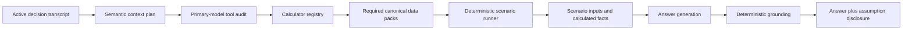

# Deterministic scenario modeling

Ask Linc can answer a supported what-if question with newly calculated, conditional results. A scenario result is not an observed financial fact and is not a forecast or guarantee. It is a deterministic model output produced from the user's canonical data plus a disclosed assumption ledger.

The registered calculators cover retirement withdrawal planning, target-home affordability, Coast FIRE, and a retirement plan from stated figures for accounts with no holdings linked. The scenario boundary lives under `src/scenarios/` so additional domains can add their own validated plans, packs, defaults, outputs, and execution without moving arithmetic into an LLM.

## Request flow

```mermaid
flowchart LR
    A["Active decision transcript"] --> B["Semantic context plan"]
    B --> C["Primary-model tool audit"]
    C --> D["Calculator registry"]
    D --> E["Required canonical data packs"]
    E --> F["Deterministic scenario runner"]
    F --> G["Scenario inputs and calculated facts"]
    G --> H["Answer generation"]
    H --> I["Deterministic grounding"]
    I --> J["Answer plus assumption disclosure"]
```

1. The OpenAI preflight planner identifies requested scenarios and returns a strict `scenarios` object keyed by registered calculator ID. It does not calculate results.
2. The configured primary Claude model audits the same keyed plans while making its required `request_data_packs` call. It can supply a plan the preflight omitted, but it does not receive data access or arithmetic authority.
3. The registry supplies required packs for every planned calculator and the pipeline widens context once for their combined dependencies.
4. Application code removes every traced retirement override from the inputs used to gather its baseline. Equality with a stated input does not exempt a field: "what if I retire at 58 instead" reaches the planner as both, and admitting it would rebuild the baseline on the hypothetical. The plan as stated is kept alongside for step 5. Retirement analysis is deferred until both planning passes finish, then completed from the already-loaded snapshot when packs did not widen. A scenario discovered by either model cannot persist its hypothetical values as the baseline, and ordinary retirement requests no longer repeat a full context gather.
5. Whether the withheld values are needed after all is decided where the stored plan and the profile are in hand. If the baseline stops for want of planning inputs the requested variant is carrying, the pipeline completes it once more from the *stated* plan (before overrides were removed), folding in only fields that plan still lacks, and only when they close every gap. Starting from the stripped baseline would adopt a genuine what-if override as the comparison base. This is how a user stating a plan for the first time gets a projection instead of being asked for numbers they just gave while the scenario reports that it has no baseline. A user with a plan on file never reaches it: their stored inputs build the baseline and the variant is compared against it.
6. The registry executes each planned calculator by ID. The retirement runner inherits the completed baseline's portfolio and planning inputs. The home-affordability runner combines traced purchase inputs with connected cash and cash-flow aggregates plus the structured mortgage-rate observation. Each runner validates inputs and runs at most two variants.
7. Each calculator promotes its own validated inputs and outputs into `scenario_input` and `scenario_calculation` facts. It also owns compact evidence and deterministic assumption disclosure hooks.
8. The ordinary response validator verifies every displayed scenario value against those facts. Registry disclosures are appended even if the model omits them.

If a baseline or required holding data is unavailable, the runner returns a specific unavailable result. Ask Linc explains the missing prerequisite instead of inventing a number.

## Calculator registry

`src/scenarios/calculator-registry.ts` is the application-owned catalog. Every calculator definition declares:

- a stable ID and version;
- required semantic data packs;
- the exact overrides application code accepts, including type and bounds;
- named defaults and when they apply;
- the outputs the calculator can promote into evidence;
- its strict planner schema, semantic instructions, parser, executor, unavailable result, and compact evidence projection.
- its canonical-fact projection and deterministic assumption disclosure.

The registry builds the keyed preflight and primary-audit schemas, parses plans, combines their required packs, executes them, projects canonical facts, compacts Show the Math evidence, and produces assumption disclosures. A model can propose a registered plan, but it cannot add a calculator, pack, override, default, or output that application code did not register.

## Retirement withdrawal policies

The starting spending amount is expressed in today's dollars. Before withdrawals begin, every policy uses the historical sequence's CPI to translate that amount to its nominal value at withdrawal start. This holds initial purchasing power constant so the comparison isolates what happens after withdrawals begin.

| Policy | Behavior after withdrawals begin |
| --- | --- |
| `historical_cpi` | Adjusts monthly with the CPI path in each historical sequence. This is the existing baseline and represents constant real spending. |
| `flat_nominal` | Freezes the nominal withdrawal amount. Purchasing power generally falls over time when inflation is positive. |
| `fixed_growth` | Changes the nominal amount once per withdrawal anniversary by the requested annual rate. |

If a user requests a fixed annual bump but gives no rate, the runner uses 3% and marks it as a default. The answer explicitly discloses that assumption. Model-supplied rates outside the accepted semantic-plan range are discarded rather than silently driving a projection.

## Retirement v2 overrides

Every numeric override is accepted only when the semantic plan includes the user's short source wording. Untraceable model-supplied values are dropped before execution.

| Override | Behavior |
| --- | --- |
| Starting annual spending | Replaces the baseline retirement spending amount in today's dollars. |
| Annual pre-withdrawal contributions | Adds monthly contributions before withdrawals begin. The annual amount is in today's dollars and follows each historical sequence's CPI. |
| Retirement age | Changes retirement age and, unless separately supplied, withdrawal start age. |
| Withdrawal start age | Changes the accumulation/withdrawal boundary independently of retirement age. |
| Life expectancy | Changes the modeled withdrawal horizon. |
| Withdrawal policy and fixed growth rate | Controls spending growth after withdrawals begin. |

Inputs not overridden remain inherited from the completed baseline:

- current age;
- current holdings and security mapping;
- the historical sequence methodology, return data, rebalancing, and end-of-period withdrawal timing.

The default annual contribution is zero. Contributions are invested monthly at the portfolio's target allocation after that month's returns, stop before the first withdrawal, and are included in the real portfolio value measured at withdrawal start.

## Home affordability v1

The `home_affordability` calculator evaluates a specific target home against household cash flow. It is not a lender-underwriting or maximum-qualification calculator. Plaid Liabilities is not a prerequisite: connected total cash and transaction-based average income and expenses are used when they are linked, while the current housing cost being replaced is accepted only as a traced user input. Stated take-home pay, monthly spending and available cash outrank linked figures, and a cash total of zero with no cash account linked is unknown rather than a shortfall, so someone with nothing linked gets the whole assessment from what they state (see `docs/ANSWER_FIRST.md`).

Each variant can change:

- target home price and available purchase cash;
- down payment amount or percentage;
- mortgage rate and fully amortizing term;
- closing, moving, and immediate repair costs;
- property taxes, homeowners insurance, HOA dues, mortgage insurance, and maintenance;
- current housing cost, the emergency-fund target, and a take-home-funded monthly retirement contribution to preserve.

When the user omits them, the runner uses named defaults of 20% down, a 30-year loan, 3% closing costs, a 1% annual maintenance reserve, and a six-month emergency-fund target. A user-supplied mortgage rate takes precedence over the structured FRED 30-year fixed-rate observation. The runner never parses a rate out of model prose.

Property taxes and homeowners insurance have no universal safe default. They are excluded when absent, the monthly ownership result is marked as a lower bound, and downstream cash-flow or reserve facts carry the same caveat. Mortgage insurance is treated the same way when the down payment is below 20%. The runner returns an `incomplete` assessment instead of declaring the purchase affordable until those recurring costs, available cash, connected income and expenses, and the current housing cost being replaced are all available.

A stated current housing cost above the connected spending baseline means the two series disagree — housing paid from an unconnected account, or a categorization gap. Subtracting it would understate post-purchase spending, so the runner drops the spending baseline, records the shortfall in `missingInputs`, and still returns the upfront-cash and monthly-cost results instead of failing the whole calculation. A benchmark mortgage rate that arrives as zero or negative is treated as a provider fault rather than an interest-free loan; only an explicitly stated rate may be non-positive. An unusable comparison case is reported in `comparisonUnavailableReason` and never discards a valid primary case.

Outputs include mortgage principal, principal and interest, all-in monthly ownership cost, upfront cash needed, cash remaining, the change from current housing cost, post-purchase operating surplus, cash runway, and the emergency-fund gap. Existing payroll-deducted retirement contributions are already reflected in connected net deposits and are not subtracted again. When the user states a contribution funded from take-home cash, such as a checking-to-IRA transfer, the runner reports the surplus remaining after it and whether it still fits. Transfers and investment trades are excluded from the operating-expense baseline, so this explicit adjustment is subtracted exactly once and carries that funding caveat in canonical evidence.

A completed variant also names its binding constraint: the first failing constraint in the order upfront cash, monthly cash flow, a stated take-home-funded retirement contribution, emergency-fund floor, or `none` when all of them clear. Closing is impossible without the upfront cash, a negative operating surplus is structural, and the reserve floor is a cushion rather than a payment obligation. The binding constraint is withheld while the assessment is `incomplete`, because a missing input is not a shortfall. Two requested variants also receive deterministic monthly-cost and upfront-cash comparisons.

## Before anything is linked

Everyone the public calculators send to Ask Linc arrives with no accounts linked, and their first follow-up is about the run that opened their account. The holdings-based retirement projection has nothing to run for them, so those follow-ups used to end on "link an investment account" with no reason given. Two calculators answer them from the figures the user states instead, and linking becomes the upgrade rather than the price of an answer.

### Coast FIRE

The `coast_fire` calculator runs `services/coast-fire.ts`, the same formula the public page uses, on stated figures. Current age falls back to an age the user told Linc earlier and savings to the connected investment total; the return (5%) and withdrawal rate (4%) fall back to the public calculator's defaults, and retirement income to none. Each fallback is named in the disclosure. Age and savings are never defaulted, and neither is spending when nothing linked says what the user spends: a request missing one asks for it ("no linked accounts needed") instead of running. A missing retirement age is the conventional 65 while it is still ahead of the user, and missing spending is their current spending when linked cash flow shows it; both are named in the disclosure. See `docs/ANSWER_FIRST.md`.

Given what the user invests each year, it also finds the first birthday at which savings could stop receiving new money and still reach the target. Contributions are added once a year, at the end of the year, and reaching the target only in the retirement year is not reported as coasting. A stated range ("$74,000 to $83,000") is planned as two variants, low and high.

Wherever a preset stands in for the user's holdings (see below), it also runs the savings through the public retirement calculator's engine on a disclosed preset mix (Balanced unless the user names Conservative or Growth): today's savings left alone until the retirement age, then spent through age 95, with any retirement income counted from the retirement date. The straight line says whether one average return clears the bar; the history says how often coasting from today actually would have. On the calculator lead in the screenshots that prompted this (38, $500,000, retiring at 55 on $80,000 a year), the money lasted in 10 of 517 historical sequences. The test runs once per distinct case, since contributions do not enter it, and it is skipped, never bent, when an input falls outside the engine's bounds (savings under $1,000, or retirement income starting before 50 or after 80). A failed test never costs the user the straight-line answer.

It requires the retirement pack. Coast FIRE itself needs nothing linked, but a user who has linked holdings then gets the holdings-based projection of leaving them alone until retirement in place of the preset test.

### Retirement plan from stated figures

The `stated_retirement_plan` calculator runs the public retirement calculator's engine (`services/retirement-quickplan.ts`): the user's stated plan against the full historical record, on a disclosed preset mix rather than their holdings. It never defaults the amount invested or the current age; it asks for them, and offers linking as the alternative. A missing retirement age is the conventional 65 (or now, for someone past it). A missing spending level is the user's current spending when their linked cash flow shows it; with nothing to read it from, the engine runs in its `rates` mode and the answer reports what the mix sustained in a bad and a typical stretch of history instead of a verdict. Every one of these is named in the disclosure. The mix defaults to the Balanced preset and the horizon to age 95. A change to an earlier plan ("what if I retire at 62 instead?") runs as a comparison against the plan as first stated. The engine's fixed levers (retire two or five years later, spend 10% less) are promoted as facts for the primary case.

It declares `appliesTo`: it runs only where the holdings-based projection cannot, and otherwise its plan is dropped before execution and the holdings-based projection answers. A dropped plan is not recorded as a request, so Answer Quality does not count it as a scenario that failed to run. It also declares `yieldsTo: ['coast_fire']`: Coast FIRE's market-history test runs the same engine on the same savings, so when both are planned for one answer the stated plan is dropped rather than showing two near-identical histories.

### Where a preset stands in

`src/scenarios/preset-stand-in.ts` is the one rule both calculators use. A preset mix stands in for the user's holdings in two cases: no holdings are linked, or holdings are linked and none of them maps to a return series the engine can simulate (`no_supported_simulation`, an all-crypto account, say). Disclosures name which case it was: "no investment holdings are linked" for the first, "none of your linked holdings map to a return series I can simulate" for the second, which also never offers linking to someone who already has.

### What the answer says about linking

`collectMissingInputAsks` decides the note for a retirement question with no holdings linked, and it closes the answer, after every assumption disclosure:

- after a stated plan ran: what linking would change about it (the real mix and balances instead of the preset);
- after Coast FIRE ran: that linking runs the same market-history test on what the user holds instead of the preset (or, if the test was skipped, that linking adds one);
- while either calculator is asking for figures: nothing, since that ask already offers linking;
- otherwise: why the projection needs holdings, and that stated figures get a preset-mix run in the meantime.

The retirement scenario's "a completed retirement baseline is required" disclosure is suppressed whenever the baseline was blocked by something that note, or another missing-input ask, already explains.

## Evidence and persistence

Each scenario ID is a SHA-256 content fingerprint of its validated inputs, calculator version, and core outputs. Retirement IDs include the portfolio/security boundary, planning inputs, and withdrawal policy. Home-affordability IDs include the resolved purchase, mortgage, ownership-cost, cash, and cash-flow assumptions. The compact execution record includes:

- calculator and schema version;
- calculation time and status;
- the calculator-specific assumption ledger and origins;
- the calculator-specific metrics, comparisons, coverage limitations, and assessment state.

Records are persisted inside the conversation's Show the Math evidence manifest under `scenarioExecutions[calculatorId]`, and the Show the Math UI exposes both the keyed plan and calculation records. The Answer Quality admin report reads this keyed form plus the legacy singular retirement field, keeps its existing answer-level completion summary, and reports completed or unavailable calculations per calculator so a mixed run cannot hide a successful peer.

## Relevant files

| File | Responsibility |
| --- | --- |
| `src/scenarios/calculator-registry.ts` | Calculator manifest, lookup, parsing, execution, and evidence contracts |
| `src/scenarios/retirement-scenario.ts` | Plan schema, validation, execution, IDs, assumption ledger, canonical facts, disclosure, and compact evidence |
| `src/scenarios/home-affordability-scenario.ts` | Target-home inputs, mortgage and ownership-cost math, lower-bound coverage rules, cash-flow outputs, canonical facts, and disclosure |
| `src/scenarios/coast-fire-scenario.ts` | Coast FIRE from stated figures, the contribution path to coasting, canonical facts, and disclosure |
| `src/scenarios/stated-retirement-plan-scenario.ts` | The quick-plan engine on stated figures while no holdings are linked, canonical facts, and disclosure |
| `src/openai/missing-inputs.ts` | The closing note when no holdings are linked, tailored to the calculator that answered |
| `src/retirement-analytics/engine/withdrawal-simulator.ts` | Withdrawal policy mechanics |
| `src/openai/context-planner.ts` | Semantic scenario identification in the preflight pass |
| `src/openai/claude-client.ts` | Scenario audit in the primary model's forced tool call |
| `src/openai/analysis-pipeline.ts` | Pack widening, scenario execution, prompting, validation, and evidence |
| `src/openai/canonical-facts.ts` | Scenario-scoped facts and provenance |
| `src/openai/retirement-assumptions.ts` | Baseline retirement disclosure and legacy scenario-disclosure compatibility |
| `src/services/answer-quality.ts` | Scenario operational metrics |

## Next registered calculators

The registry boundary is designed for the following sequence, with each calculator added only when its deterministic engine and canonical outputs exist:

1. career-break and income-change cash flow;
2. debt payoff strategies;
3. portfolio allocation and downturn stress tests;
4. savings-goal timelines.
