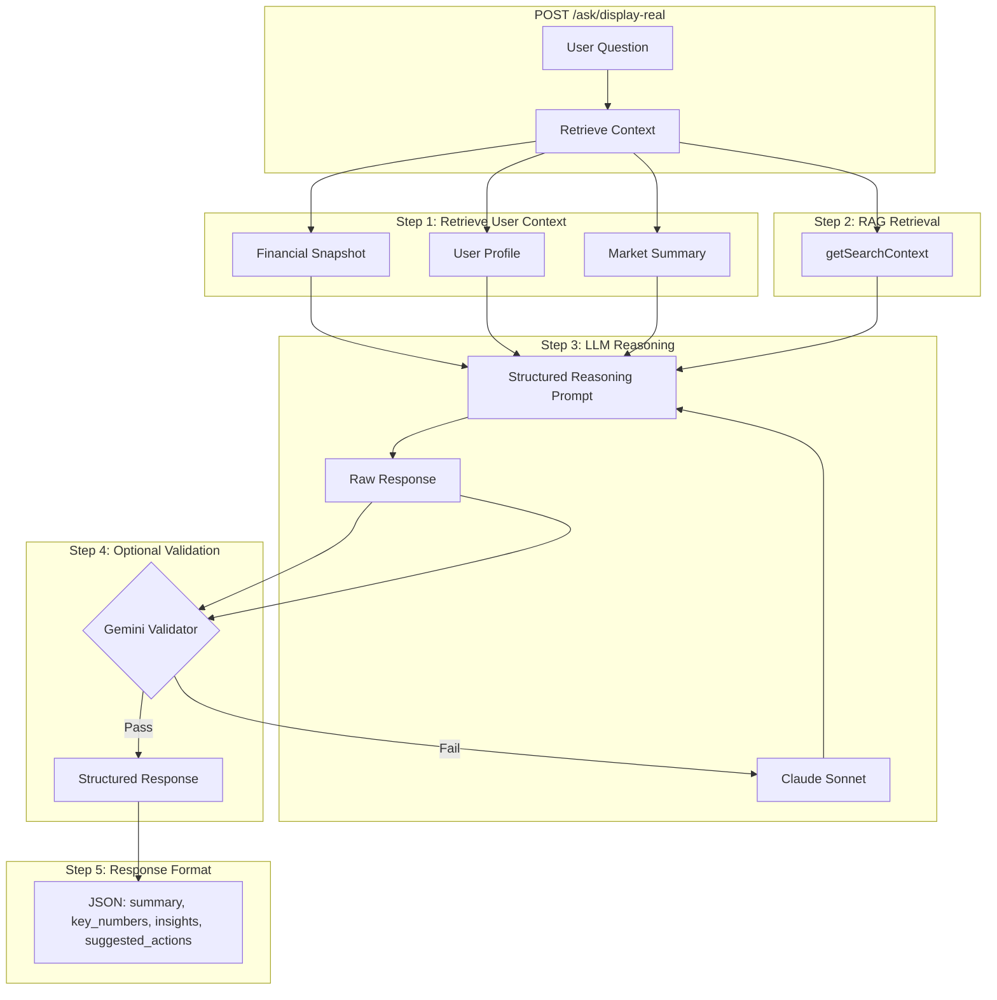

# Ask Linc LLM Financial Analysis Layer

This document describes the **LLM-driven financial reasoning pipeline** for Ask Linc—the analysis layer that orchestrates existing systems (financial snapshot, user profile, market summary, RAG) and performs financial reasoning using Claude Sonnet.

---

## Design Objective

Ask Linc behaves like an **AI financial analyst**, not a generic chatbot. The system prioritizes:

- **Transparency** — Show reasoning steps and formulas
- **Explainable calculations** — Step-by-step with intermediate values
- **Grounded financial reasoning** — No invented data; clearly state assumptions
- **Clear guidance** — Practical, actionable insights for the user

---

## Architecture Overview



---

## System Flow

1. **User question** → Input validation (security, off-topic rejection)
2. **Retrieve financial snapshot** → `SummaryCacheService.getLatestSnapshot(userId, 'full')`
3. **Retrieve persistent user profile** → `ProfileManager.getOriginalProfile(userId)`
4. **Retrieve daily market summary** → `MarketNewsManager.getMarketContext(tier)` or `dataOrchestrator.getMarketContextSummary()`
5. **Call RAG retrieval** → `dataOrchestrator.getSearchContext(question, tier, isDemo)` for question-specific financial knowledge
6. **LLM financial reasoning** → Claude Sonnet 4.5 (`claude-sonnet-4-5`) with structured reasoning prompt
7. **Optional validation** → Gemini checks calculation consistency, logical reasoning, unsupported assumptions
8. **Structured response** → JSON with `summary`, `key_numbers`, `insights`, `suggested_actions`

---

## Existing Systems (Orchestrated, Not Rebuilt)

The pipeline uses these existing systems as inputs:

| System | Source | Purpose |
|--------|--------|---------|
| Financial snapshot | Plaid, SnapTrade, CSV, manual entry | Normalized financial state |
| User profile | `ProfileManager` | Goals, risk tolerance, retirement plans, inferred context |
| Market summary | FRED, Alpha Vantage, Search | Interest rates, inflation, market trends |
| RAG | `dataOrchestrator.getSearchContext` | Retirement rules, tax guidelines, mortgage rules, financial concepts |

---

## Canonical Financial Snapshot

The pipeline transforms the raw snapshot into a **canonical format** for LLM consumption:

```json
{
  "assets": {
    "cash": 54000,
    "brokerage": 240000,
    "retirement": 780000
  },
  "liabilities": {
    "mortgage": 420000
  },
  "income": 210000,
  "expenses": 115000,
  "age": 46,
  "retirement_goal_age": 62
}
```

- **Assets** — Derived from account types (depository → cash, brokerage → brokerage, 401k/IRA → retirement)
- **Liabilities** — Mortgage from account breakdown or `totalDebt` fallback
- **Income/expenses** — Parsed from `incomeAnalysis` / `expenseAnalysis` strings (monthly × 12)
- **Age/retirement_goal_age** — Extracted from profile via `extractAgeFromProfile` / `extractRetirementAgeFromProfile`

---

## Structured Reasoning Prompt

The LLM follows a five-section format:

1. **Data Extraction** — Identify relevant financial values from snapshot or profile
2. **Calculation Plan** — Explain which financial rules or formulas apply
3. **Calculations** — Step-by-step with formulas and intermediate values
4. **Interpretation** — What results mean for the user's situation
5. **Guidance** — Clear, practical financial insights

**Rules:**

- Do not invent financial data that is not present
- Clearly state assumptions
- Show formulas when performing calculations
- Be conservative with estimates

---

## Structured Response Format

The API returns:

```json
{
  "summary": "Based on your current savings and spending, you are not yet on track to retire at age 62.",
  "key_numbers": {
    "retirement_assets": 780000,
    "estimated_safe_withdrawal": 31200
  },
  "insights": [
    "Your retirement savings would support roughly $31K annually using the 4% rule.",
    "Your current spending is significantly higher than that level."
  ],
  "suggested_actions": [
    "increase retirement contributions",
    "reduce retirement spending",
    "consider delaying retirement"
  ]
}
```

- **summary** — One-paragraph answer for the user
- **key_numbers** — Important metrics (optional)
- **insights** — Supporting observations (optional)
- **suggested_actions** — Actionable next steps (optional)

---

## Implementation Files

| File | Purpose |
|------|---------|
| `src/openai/canonical-snapshot.ts` | Maps `FinancialContextSnapshot` to canonical format |
| `src/openai/financial-reasoning-prompt.ts` | Structured reasoning prompt template |
| `src/openai/structured-response.ts` | Response schema and JSON parser |
| `src/openai/claude-client.ts` | Claude Sonnet integration |
| `src/openai/response-validator.ts` | Optional Gemini validation |
| `src/openai/analysis-pipeline.ts` | Pipeline orchestrator |

---

## Configuration

### Environment Variables

| Variable | Required | Purpose |
|----------|----------|---------|
| `USE_ASK_LINC_PIPELINE` | No | Set to `true` to enable the Claude pipeline (default: `false`) |
| `ANTHROPIC_API_KEY` | Yes (when enabled) | Claude Sonnet API key |
| `ENABLE_RESPONSE_VALIDATION` | No | Set to `true` for Gemini validation (default: `false`) |
| `GOOGLE_AI_API_KEY` or `GEMINI_API_KEY` | No | For Gemini validation when enabled |

### Feature Flag

When `USE_ASK_LINC_PIPELINE=true`:

- `/ask/display-real` calls `runAskLincAnalysis` instead of `askOpenAIWithEnhancedContext`
- On pipeline failure, falls back to OpenAI
- Response includes `structuredResponse` when available

---

## Frontend Integration

When `structuredResponse` is present, the frontend renders:

- **Summary** — Main paragraph (Markdown)
- **Key numbers** — Compact badges with metric names and values
- **Insights** — Bullet list
- **Suggested actions** — Bullet list

Fallback: uses `answer` (formatted display text) for backward compatibility.

---

## Future Extensibility

The architecture supports replacing LLM calculations with **deterministic financial engines**:

- The pipeline accepts a `calculationEngine` abstraction
- Canonical snapshot format is stable
- Structured response format is stable
- LLM can be swapped for rule-based or formula-driven engines without changing the API contract

---

## Related Documentation

- [RAG System](RAG_SYSTEM.md) — RAG retrieval used by the pipeline
- [GPT Prompt Construction](GPT_PROMPT_CONSTRUCTION.md) — Legacy OpenAI prompt structure
- [AI Performance Monitoring](../monitoring/AI_PERFORMANCE_MONITORING.md) — Monitoring and observability
