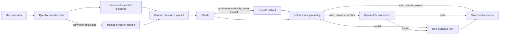

# Ask Linc LLM Financial Analysis Layer

This document describes Ask Linc's canonical-facts analysis pipeline. Deterministic application code owns financial values and arithmetic; the language model explains those facts and helps the user interpret them.

---

## Design Objective

Ask Linc behaves like an **AI financial analyst**, not a generic chatbot. The system prioritizes:

- **Transparency** — Persist compact fact provenance and calculation manifests for Show the Math
- **Explainable calculations** — Compute authoritative arithmetic locally and give the model the result plus formula provenance
- **Grounded financial reasoning** — No invented data; clearly state assumptions
- **Clear guidance** — Practical, actionable insights for the user
- **Low latency** — Retrieve and validate only what the question needs

---

## Architecture Overview



---

## System Flow

1. **User question** → Input validation (security, off-topic rejection)
2. **Classify question needs** → decide whether account rows, transaction rows, holdings, market context, search, retirement analysis, or secondary validation are relevant
3. **Retrieve a canonical projection** → `SummaryCacheService.getSnapshotForAnalysis()` always loads aggregate truth and opts into large JSON columns only as needed
4. **Retrieve optional context** → market and search providers run only for explicit external/current-market questions
5. **Build canonical facts and a compact context pack** → application code calculates cash flow, savings rate, and requested transaction aggregates; unrelated sections are omitted
6. **LLM analysis** → Claude returns one structured JSON object; if Claude is unavailable, OpenAI receives the exact already-built prompt without gathering context again
7. **Ground deterministically** → every key number must copy a canonical fact's value, unit, and provenance; every money or percentage in prose must match a fact
8. **Validate selectively** → Gemini is reserved for projections, retirement, comparisons, recommendations, and other complex calculations
9. **Retry once when needed** → validation issues are fed back to the active provider using the same context pack; a still-ungrounded answer is replaced with a safe response
10. **Structured response** → JSON with `summary`, `key_numbers`, `insights`, `suggested_actions`

---

## Existing Systems (Orchestrated, Not Rebuilt)

The pipeline uses these existing systems as inputs:

| System | Source | Purpose |
|--------|--------|---------|
| Financial snapshot | Plaid, SnapTrade, CSV, manual entry | Normalized financial state |
| User profile | `ProfileManager` | Goals, risk tolerance, retirement plans, inferred context |
| Market summary | FRED, Alpha Vantage, Search | Interest rates, inflation, market trends when explicitly relevant |
| RAG | `dataOrchestrator.getSearchContext` | Current rates, laws, limits, and external financial concepts when explicitly relevant |
| Retirement analysis | `analyzeRetirementPortfolio` | Portfolio stress test, historical withdrawal rate percentiles |

---

## Canonical Financial Snapshot

The pipeline reads the same persisted canonical revision used by the application. A typical aggregate projection is:

```json
{
  "financialOverview": {
    "netWorth": 654000,
    "totalCash": 54000,
    "totalInvestments": 1020000,
    "totalDebt": 420000,
    "homeValue": null
  },
  "transactionsSummary": {
    "incomeTotal": 210000,
    "expenseTotal": 115000,
    "byMonth": {}
  }
}
```

- **Overview totals** come directly from `financialSummarySnapshot.financialOverview`; the LLM must not recompute them from detail rows.
- **Monthly income and expenses** come from persisted `transactionsSummary.byMonth`, using the same canonical transaction classifications and exclusions as the app. Manual overrides replace only the displayed monthly average, not the persisted totals.
- **Account balances** use the revision-aligned display balance persisted in snapshot metadata, falling back to current balance before available balance.
- **Show the Math** persists the exact canonical facts, snapshot timestamp, formulas, provider metrics, and evidence references. It does not persist full prompts, raw model output, or the entire snapshot. Referenced database evidence is loaded only when the user opens the view.
- **Performance evidence** records context-gather time, prompt-build time, time to the first final-answer token, provider duration, and prompt character count. The request span receives the same key latency and prompt-size metrics for production comparison.

---

## Structured Reasoning Prompt

The LLM receives one compact set of grounding and output rules. It reasons internally and returns only the structured response; the prompt does not request a second, contradictory five-section narrative.

Rules:

- Do not invent financial data that is not present
- Clearly state assumptions
- Copy canonical facts exactly; do not perform authoritative arithmetic
- Be conservative with estimates
- Emit explicit value, unit, and canonical provenance for every key number
- Mention only money and percentage values present in the fact pack
- Include only `(EXPENSE)` and `(FEE)` records in spending detail

---

## Structured Response Format

The API returns:

```json
{
  "summary": "Based on the retirement analysis in your current snapshot, your planned withdrawal rate is above the range supported by the historical stress test.",
  "key_numbers": {
    "portfolio_value": {
      "value": 780000,
      "unit": "usd",
      "provenance": "portfolio_value"
    },
    "withdrawal_rate": {
      "value": 4.0,
      "unit": "percent",
      "provenance": "withdrawal_rate"
    }
  },
  "insights": [
    "The result is most sensitive to planned withdrawals and the portfolio mix.",
    "The historical stress test is evidence, not a forecast."
  ],
  "suggested_actions": [
    "increase retirement contributions",
    "reduce retirement spending",
    "consider delaying retirement"
  ]
}
```

- **summary** — One-paragraph answer for the user
- **key_numbers** — Important canonical metrics with explicit `value`, `unit`, and `provenance` (optional)
- **insights** — Supporting observations (optional)
- **suggested_actions** — Actionable next steps (optional)

---

## Implementation Files

| File | Purpose |
|------|---------|
| `src/services/canonical-financial-snapshot.ts` | Produces canonical financial metrics and source-quality metadata |
| `src/openai/context-service.ts` | Loads persisted canonical values and assembles LLM context |
| `src/openai/question-analysis.ts` | Selects question-specific data and validation needs |
| `src/openai/canonical-facts.ts` | Builds and locally validates question-specific numeric facts and calculations |
| `src/openai/context-pack.ts` | Produces the compact detail payload selected for the question |
| `src/openai/cash-flow-context.ts` | Builds monthly income/expense context from the canonical summary |
| `src/openai/retirement-inputs.ts` | Resolves explicit retirement assumptions and reports missing inputs |
| `src/openai/financial-reasoning-prompt.ts` | Structured reasoning prompt template |
| `src/openai/structured-response.ts` | Response schema and JSON parser |
| `src/openai/response-facts.ts` | Normalizes and validates response values, units, provenance, and prose claims |
| `src/openai/claude-client.ts` | Claude Sonnet integration |
| `src/openai/openai-fallback-client.ts` | OpenAI provider fallback using the already-built prompt |
| `src/openai/response-validator.ts` | Optional Gemini validation |
| `src/openai/show-the-math-db-service.ts` | Lazily expands compact evidence manifests |
| `src/openai/analysis-pipeline.ts` | Pipeline orchestrator |

---

## Configuration

### Environment Variables

| Variable | Required | Purpose |
|----------|----------|---------|
| `ANTHROPIC_API_KEY` | Yes | Claude Sonnet API key |
| `OPENAI_API_KEY` | Yes for provider fallback | OpenAI fallback API key |
| `OPENAI_FALLBACK_MODEL` | No | Override OpenAI fallback model (default: `gpt-4o`) |
| `ENABLE_RESPONSE_VALIDATION` | No | Set to `true` for Gemini validation (default: `false`) |
| `GOOGLE_AI_API_KEY` or `GEMINI_API_KEY` | No | For Gemini validation when enabled |
| `GEMINI_VALIDATION_MODEL` | No | Override Gemini model (default: `gemini-3-flash-preview`) |
| `ASK_LINC_MAX_OUTPUT_TOKENS` | No | Maximum primary and fallback output tokens (default: `8192`) |

### Production path

- `/ask/display-real` always calls `runAskLincAnalysis`
- If Claude is unavailable, the pipeline calls OpenAI with the same prepared prompt and does not reload the snapshot, RAG, or market context
- Response includes `structuredResponse` when available
- `/ai/performance` reports process-local stage percentiles and quality rates

---

## Frontend Integration

When `structuredResponse` is present, the frontend renders:

- **Summary** — Main paragraph (Markdown)
- **Key numbers** — Compact badges with metric names and values
- **Insights** — Bullet list
- **Suggested actions** — Bullet list

Fallback: uses `answer` (formatted display text) for backward compatibility.

---

## Retirement Analysis Context

When the user asks retirement-related questions, the pipeline fetches or creates a **retirement portfolio analysis** and injects it into the LLM context. This includes:

- **Portfolio characteristics** — Growth potential, drawdown resistance, withdrawal fragility, inflation protection
- **Historical withdrawal rate percentiles** — p10, p25, p50, p75, p90 derived from simulations over historical market sequences
- **Stress test results** — Survival rate, depletion percentiles, worst-case sequences

The analyzer never invents the user's current age, retirement age, or desired withdrawal amount. It resolves values from the current question, the user profile, or the explicit inputs stored with a recent matching analysis. If required values are still missing, Linc asks for them before running the analysis. The default life-expectancy assumption is 95 and is shown with the analysis parameters.

Cached analysis is reused only when the portfolio fingerprint and the resolved current age, retirement age, annual withdrawal, withdrawal start age, and life-expectancy assumption match. This prevents unnecessary recomputation without applying results to a different portfolio or scenario.

### Stress Test Data and Methodology

The stress test engine is **fully offline and deterministic**. It uses:

- **Data source** — Local datasets (Shiller `ie_data.xls`, Kenneth French `F-F_Research_Data_Factors.csv`) transformed into `data/historical_market_returns.csv` at build time. No ETF proxies or external API calls. International equity uses US equity as proxy (diversification not modeled).
- **Coverage** — 50+ years of market history (1970 → present) with monthly start windows.
- **Withdrawals** — Inflation-adjusted (constant real spending); withdrawals grow with CPI each month.
- **Portfolio** — Four sleeves (US equity, international equity, bonds, cash) with annual rebalancing to target weights.
- **Sequences** — Full-horizon only; no truncated sequences. Exact withdrawal horizon (no 10/20/30 bucketing).

See [Stress Test Approach](STRESS_TEST_APPROACH.md) for full documentation.

### Withdrawal Rate Percentile Semantics

The percentiles are **empirically grounded** (not heuristic). They represent the distribution of sustainable withdrawal rates across historical market environments:

| Percentile | Meaning |
|------------|---------|
| **p10** | Conservative low rate—sustainable in 90% of historical sequences (worst 10% of environments) |
| **p25** | Rate sustainable in 75% of sequences (poor markets) |
| **p50** | Median historical sustainable withdrawal rate |
| **p75** | Rate sustainable in 25% of sequences (strong markets) |
| **p90** | Aggressive high rate—sustainable in only 10% of sequences (best environments) |

The LLM is instructed to compare the user's withdrawal rate to these percentiles when answering feasibility questions. See [Historical Withdrawal Rate Solver](HISTORICAL_WITHDRAWAL_RATE_SOLVER.md) for algorithm details.

---

## Related Documentation

- [Stress Test Approach](STRESS_TEST_APPROACH.md) — Sequence generation, simulation, and data sources
- [Historical Withdrawal Rate Solver](HISTORICAL_WITHDRAWAL_RATE_SOLVER.md) — Algorithm and percentile semantics
- [Retirement Analytics Integration](../RETIREMENT_ANALYTICS_INTEGRATION.md) — How retirement analysis is triggered and stored
- [GPT Prompt Construction](GPT_PROMPT_CONSTRUCTION.md) — Legacy OpenAI prompt structure
- [AI Context Optimizations](AI_CONTEXT_OPTIMIZATIONS.md) — Context selection and performance
