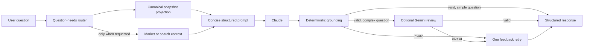

# Ask Linc LLM Financial Analysis Layer

This document describes the **LLM-driven financial reasoning pipeline** for Ask Linc—the analysis layer that orchestrates existing systems (financial snapshot, user profile, market summary, RAG) and performs financial reasoning using Claude Sonnet.

---

## Design Objective

Ask Linc behaves like an **AI financial analyst**, not a generic chatbot. The system prioritizes:

- **Transparency** — Preserve the exact analysis context and model calls for Show the Math
- **Explainable calculations** — Include concise formulas when new arithmetic materially helps
- **Grounded financial reasoning** — No invented data; clearly state assumptions
- **Clear guidance** — Practical, actionable insights for the user
- **Low latency** — Retrieve and validate only what the question needs

---

## Architecture Overview



---

## System Flow

1. **User question** → Input validation (security, off-topic rejection)
2. **Classify question needs** → decide whether account rows, transaction rows, holdings, market context, search, retirement analysis, or secondary validation are relevant
3. **Retrieve a canonical projection** → `SummaryCacheService.getSnapshotForAnalysis()` always loads aggregate truth and opts into large JSON columns only as needed
4. **Retrieve optional context** → market and search providers run only for explicit external/current-market questions
5. **Build a compact prompt** → persisted financial totals and cash-flow averages are authoritative; unused sections and older conversation turns are omitted
6. **LLM analysis** → Claude returns one structured JSON object
7. **Ground deterministically** → known `key_numbers` must match canonical snapshot values and percentages retain their true magnitude
8. **Validate selectively** → Gemini is reserved for projections, retirement, comparisons, recommendations, and other complex calculations
9. **Retry once when needed** → validation issues are fed back to Claude; any still-ungrounded key numbers are omitted
10. **Structured response** → JSON with `summary`, `key_numbers`, `insights`, `suggested_actions`

---

## Existing Systems (Orchestrated, Not Rebuilt)

The pipeline uses these existing systems as inputs:

| System | Source | Purpose |
|--------|--------|---------|
| Financial snapshot | Plaid, SnapTrade, CSV, manual entry | Normalized financial state |
| User profile | `ProfileManager` | Goals, risk tolerance, retirement plans, inferred context |
| Market summary | FRED, Alpha Vantage, Search | Interest rates, inflation, market trends when explicitly relevant |
| RAG | `dataOrchestrator.getSearchContext` | Current rates, laws, limits, and external financial concepts when explicitly relevant |
| Retirement analysis | `analyzeRetirementPortfolio` | Portfolio stress test, historical withdrawal rate percentiles |

---

## Canonical Financial Snapshot

The pipeline reads the same persisted canonical revision used by the application. A typical aggregate projection is:

```json
{
  "financialOverview": {
    "netWorth": 654000,
    "totalCash": 54000,
    "totalInvestments": 1020000,
    "totalDebt": 420000,
    "homeValue": null
  },
  "transactionsSummary": {
    "incomeTotal": 210000,
    "expenseTotal": 115000,
    "byMonth": {}
  }
}
```

- **Overview totals** come directly from `financialSummarySnapshot.financialOverview`; the LLM must not recompute them from detail rows.
- **Monthly income and expenses** come from persisted `transactionsSummary.byMonth`, using the same canonical transaction classifications and exclusions as the app. Manual overrides replace only the displayed monthly average, not the persisted totals.
- **Account balances** use the revision-aligned display balance persisted in snapshot metadata, falling back to current balance before available balance.
- **Show the Math** captures the exact projected context used for the response, so a later snapshot refresh cannot make the displayed evidence disagree with the model input.

---

## Structured Reasoning Prompt

The LLM receives one compact set of grounding and output rules. It reasons internally and returns only the structured response; the prompt does not request a second, contradictory five-section narrative.

Rules:

- Do not invent financial data that is not present
- Clearly state assumptions
- Use authoritative totals exactly and show a concise formula only for new arithmetic
- Be conservative with estimates
- Use whole-number percentage values in output (`4.15` means `4.15%`)
- Include only `(EXPENSE)` and `(FEE)` records in spending detail

---

## Structured Response Format

The API returns:

```json
{
  "summary": "Based on your current savings and spending, you are not yet on track to retire at age 62.",
  "key_numbers": {
    "retirement_assets": 780000,
    "estimated_safe_withdrawal": 31200
  },
  "insights": [
    "Your retirement savings would support roughly $31K annually using the 4% rule.",
    "Your current spending is significantly higher than that level."
  ],
  "suggested_actions": [
    "increase retirement contributions",
    "reduce retirement spending",
    "consider delaying retirement"
  ]
}
```

- **summary** — One-paragraph answer for the user
- **key_numbers** — Important metrics (optional)
- **insights** — Supporting observations (optional)
- **suggested_actions** — Actionable next steps (optional)

---

## Implementation Files

| File | Purpose |
|------|---------|
| `src/services/canonical-financial-snapshot.ts` | Produces canonical financial metrics and source-quality metadata |
| `src/openai/context-service.ts` | Loads persisted canonical values and assembles LLM context |
| `src/openai/question-analysis.ts` | Selects question-specific data and validation needs |
| `src/openai/cash-flow-context.ts` | Builds monthly income/expense context from the canonical summary |
| `src/openai/retirement-inputs.ts` | Resolves explicit retirement assumptions and reports missing inputs |
| `src/openai/financial-reasoning-prompt.ts` | Structured reasoning prompt template |
| `src/openai/structured-response.ts` | Response schema and JSON parser |
| `src/openai/response-grounding.ts` | Deterministic canonical-number validation |
| `src/openai/claude-client.ts` | Claude Sonnet integration |
| `src/openai/response-validator.ts` | Optional Gemini validation |
| `src/openai/analysis-pipeline.ts` | Pipeline orchestrator |

---

## Configuration

### Environment Variables

| Variable | Required | Purpose |
|----------|----------|---------|
| `USE_ASK_LINC_PIPELINE` | No | Set to `true` to enable the Claude pipeline (default: `false`) |
| `ANTHROPIC_API_KEY` | Yes (when enabled) | Claude Sonnet API key |
| `ENABLE_RESPONSE_VALIDATION` | No | Set to `true` for Gemini validation (default: `false`) |
| `GOOGLE_AI_API_KEY` or `GEMINI_API_KEY` | No | For Gemini validation when enabled |
| `GEMINI_VALIDATION_MODEL` | No | Override Gemini model (default: `gemini-3-flash-preview`) |
| `ASK_LINC_MAX_OUTPUT_TOKENS` | No | Maximum Claude output tokens (default: `8192`) |

### Feature Flag

When `USE_ASK_LINC_PIPELINE=true`:

- `/ask/display-real` calls `runAskLincAnalysis` instead of `askOpenAIWithEnhancedContext`
- On pipeline failure, falls back to OpenAI
- Response includes `structuredResponse` when available

---

## Frontend Integration

When `structuredResponse` is present, the frontend renders:

- **Summary** — Main paragraph (Markdown)
- **Key numbers** — Compact badges with metric names and values
- **Insights** — Bullet list
- **Suggested actions** — Bullet list

Fallback: uses `answer` (formatted display text) for backward compatibility.

---

## Retirement Analysis Context

When the user asks retirement-related questions, the pipeline fetches or creates a **retirement portfolio analysis** and injects it into the LLM context. This includes:

- **Portfolio characteristics** — Growth potential, drawdown resistance, withdrawal fragility, inflation protection
- **Historical withdrawal rate percentiles** — p10, p25, p50, p75, p90 derived from simulations over historical market sequences
- **Stress test results** — Survival rate, depletion percentiles, worst-case sequences

The analyzer never invents the user's current age, retirement age, or desired withdrawal amount. It resolves values from the current question, the user profile, or the explicit inputs stored with a recent matching analysis. If required values are still missing, Linc asks for them before running the analysis. The default life-expectancy assumption is 95 and is shown with the analysis parameters.

Cached analysis is reused only when the portfolio fingerprint and the resolved current age, retirement age, annual withdrawal, withdrawal start age, and life-expectancy assumption match. This prevents unnecessary recomputation without applying results to a different portfolio or scenario.

### Stress Test Data and Methodology

The stress test engine is **fully offline and deterministic**. It uses:

- **Data source** — Local datasets (Shiller `ie_data.xls`, Kenneth French `F-F_Research_Data_Factors.csv`) transformed into `data/historical_market_returns.csv` at build time. No ETF proxies or external API calls. International equity uses US equity as proxy (diversification not modeled).
- **Coverage** — 50+ years of market history (1970 → present) with monthly start windows.
- **Withdrawals** — Inflation-adjusted (constant real spending); withdrawals grow with CPI each month.
- **Portfolio** — Four sleeves (US equity, international equity, bonds, cash) with annual rebalancing to target weights.
- **Sequences** — Full-horizon only; no truncated sequences. Exact withdrawal horizon (no 10/20/30 bucketing).

See [Stress Test Approach](STRESS_TEST_APPROACH.md) for full documentation.

### Withdrawal Rate Percentile Semantics

The percentiles are **empirically grounded** (not heuristic). They represent the distribution of sustainable withdrawal rates across historical market environments:

| Percentile | Meaning |
|------------|---------|
| **p10** | Conservative low rate—sustainable in 90% of historical sequences (worst 10% of environments) |
| **p25** | Rate sustainable in 75% of sequences (poor markets) |
| **p50** | Median historical sustainable withdrawal rate |
| **p75** | Rate sustainable in 25% of sequences (strong markets) |
| **p90** | Aggressive high rate—sustainable in only 10% of sequences (best environments) |

The LLM is instructed to compare the user's withdrawal rate to these percentiles when answering feasibility questions. See [Historical Withdrawal Rate Solver](HISTORICAL_WITHDRAWAL_RATE_SOLVER.md) for algorithm details.

---

## Related Documentation

- [Stress Test Approach](STRESS_TEST_APPROACH.md) — Sequence generation, simulation, and data sources
- [Historical Withdrawal Rate Solver](HISTORICAL_WITHDRAWAL_RATE_SOLVER.md) — Algorithm and percentile semantics
- [Retirement Analytics Integration](../RETIREMENT_ANALYTICS_INTEGRATION.md) — How retirement analysis is triggered and stored
- [RAG System](RAG_SYSTEM.md) — RAG retrieval used by the pipeline
- [GPT Prompt Construction](GPT_PROMPT_CONSTRUCTION.md) — Legacy OpenAI prompt structure
- [AI Performance Monitoring](../monitoring/AI_PERFORMANCE_MONITORING.md) — Monitoring and observability
