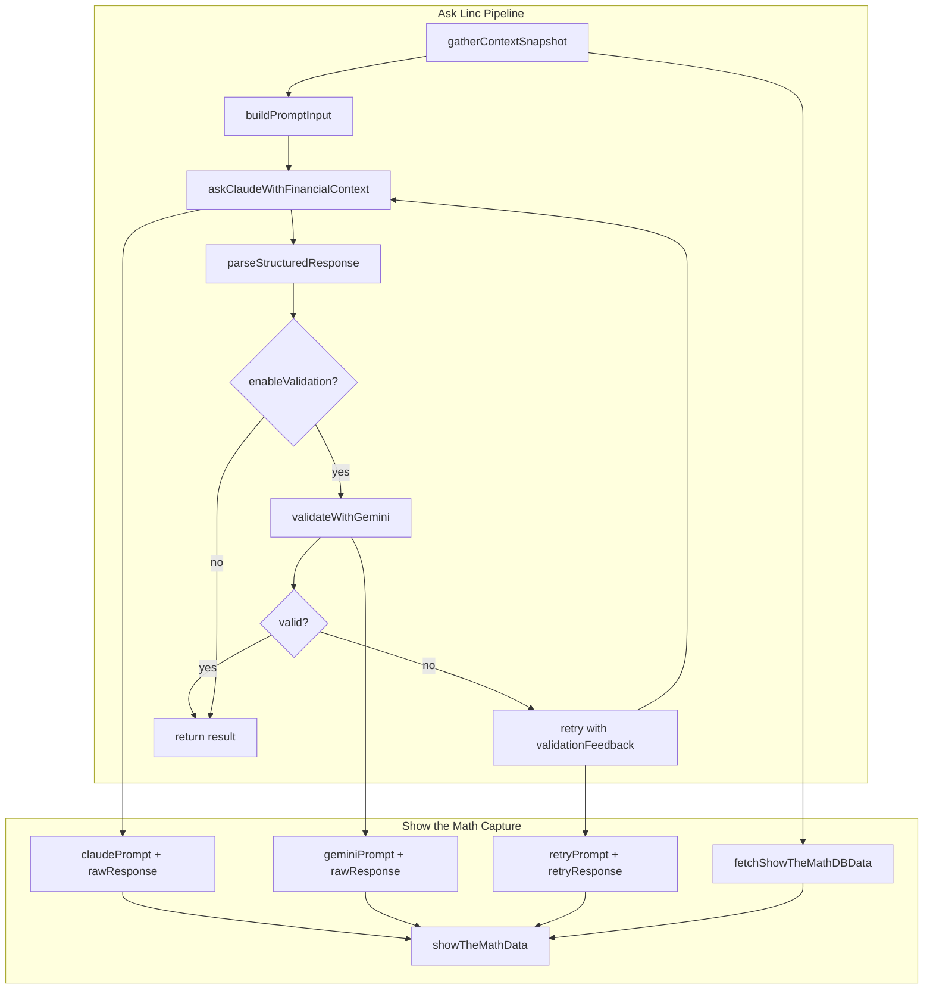

# Show the Math — Transparency Feature

This document describes the **Show the Math** feature for Ask Linc—a transparency layer that exposes the full LLM pipeline data (Claude prompts, responses, Gemini validation, and database context) to build user trust and make results explainable.

---

## Design Objective

Show the Math improves user trust by:

- **Full transparency** — Expose exactly what data was sent to and received from each AI model
- **Real-time visibility** — Stream partial pipeline data as the response is being generated
- **Auditability** — Include relevant database records so users can verify the inputs used
- **Explainable calculations** — Raw Claude responses contain the CALCULATIONS section with step-by-step reasoning

---

## User Experience

### Button and Modal

- A **"Show the math"** button appears at the **top of the LLM response box** (above the summary and key numbers)
- The button is visible when a conversation has pipeline data (either from the current response or a past conversation)
- Clicking opens a **modal** with collapsible sections containing the full transparency data

### Live Feed During Generation

- **While the prompt is running**, a collapsible **"Live transparency"** strip appears at the top of the response area
- As each pipeline step completes (context loaded, Claude responded, Gemini validated, etc.), the live feed updates in real time
- Users see exactly what data was sent and received at each stage before the final response appears
- When the response completes, the live feed is replaced by the "Show the math" button

### Modal Sections

1. **Context to Claude** — System prompt and full user message (question, financial snapshot, profile, market summary, RAG knowledge)
2. **Claude raw response (first call)** — The complete response from Claude, including DATA EXTRACTION, CALCULATION PLAN, CALCULATIONS, INTERPRETATION, and GUIDANCE sections
3. **Gemini validation** (if enabled) — Prompt sent to Gemini, raw response, and parsed result (valid/issues)
4. **Claude retry** (if validation failed) — System prompt, user message (with validation feedback), and raw response from the retry
5. **Database data** — Records from the seven tables listed below, each as a collapsible subsection

---

## Data Captured

### LLM Pipeline Data

| Step | Data Captured |
|------|---------------|
| Claude (first call) | `systemPrompt`, `userMessage`, `rawResponse` |
| Gemini validation | `prompt`, `rawResponse`, `parsedResult` (valid, issues) |
| Claude retry | `systemPrompt`, `userMessage`, `rawResponse` (when validation fails) |

### Database Tables

The feature fetches and includes records relevant to the user and their prompt:

| Table | Query | Notes |
|-------|-------|-------|
| `financial_summaries` | Latest for user | Net worth, cash, investments, debt |
| `financial_summary_snapshots` | Latest for user | Full snapshot (accounts, holdings, transactions) |
| `retirement_analyses` | Last 3 for user | Retirement metrics, stress tests |
| `asset_price_history` | By tickers from holdings | Last 90 days per ticker |
| `security_metadata` | By tickers from holdings | ETF/fund classifications |
| `market_news_context` | Active record | Daily market summary |
| `market_news_history` | Last 10 for active context | Change history |

For **demo mode** (no `userId`), user-scoped tables return empty; `market_news_context` and `market_news_history` are included when available.

---

## Architecture



---

## API Endpoints

### Production (Authenticated)

```
GET /conversations/:id/show-the-math
```

- **Auth**: Bearer token required
- **Returns**: `showTheMathData` JSON for the conversation
- **404**: Conversation not found or not owned by user; or no pipeline data (e.g. pre-feature conversation)

### Demo

```
GET /demo/conversations/:id/show-the-math
```

- **Headers**: `x-session-id` required
- **Returns**: `showTheMathData` JSON for the demo conversation
- **404**: Conversation not found or session mismatch; or no pipeline data

---

## Storage

- **Conversation**: `showTheMathData Json?` column stores the full transparency payload
- **DemoConversation**: Same `showTheMathData Json?` column
- Data is persisted when the conversation is created (production and demo)

---

## Prerequisites

- **Ask Linc pipeline** must be enabled (`USE_ASK_LINC_PIPELINE=true`)
- **Production endpoint** `/ask/display-real` is used (demo uses `/ask`, which does not populate Show the Math)
- **Live feed** requires SSE streaming (`useStreaming=true`); in non-streaming mode, the button and full data appear only after the response completes

---

## Key Files

| Area | Files |
|------|-------|
| Types | `src/openai/show-the-math-types.ts` |
| DB fetch | `src/openai/show-the-math-db-service.ts` |
| Pipeline | `src/openai/analysis-pipeline.ts` |
| Validator | `src/openai/response-validator.ts` |
| API | `src/index.ts` (handler + 2 GET routes) |
| Frontend | `frontend/src/components/FinanceQA.tsx`, `ShowTheMathModal.tsx` |
| Schema | `prisma/schema.prisma` (Conversation, DemoConversation) |

---

## Security

- Production: Only the conversation owner (`userId` match) can fetch Show the Math data
- Demo: Only the session that created the conversation (via `x-session-id`) can fetch
- Data includes raw prompts and responses; ensure access control is enforced
